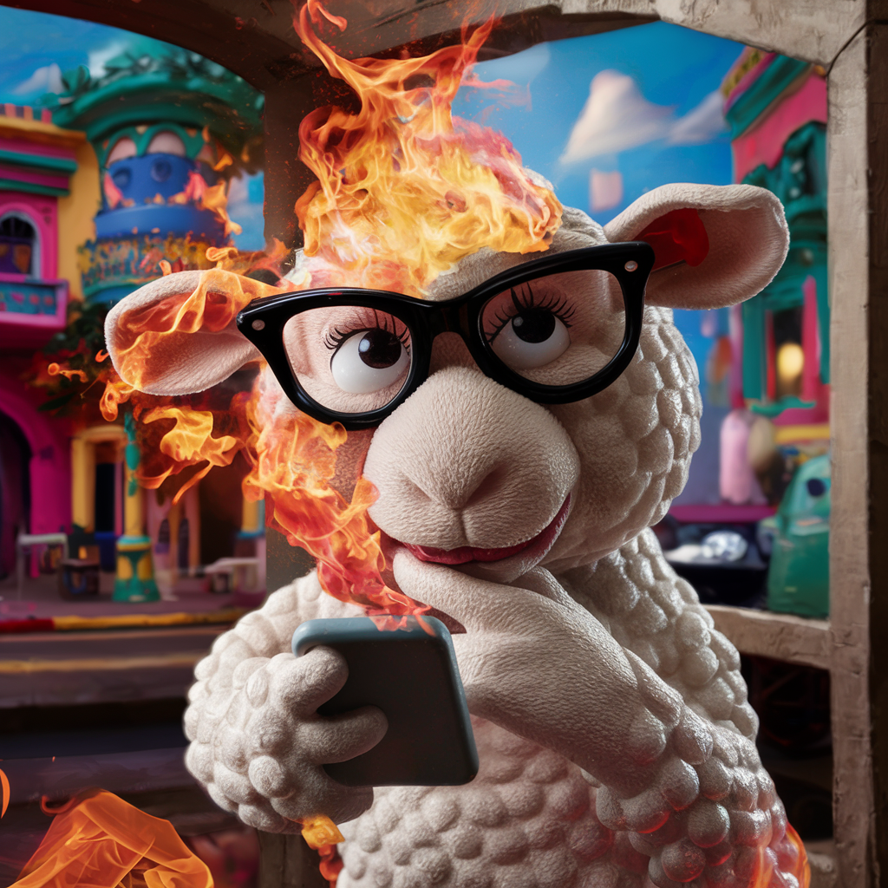

# 🖼️ Multimodal_LLAVA_Chat- Image Processing Application 🎙️

This application allows users to describe an image using voice input, and then generates a detailed description of the image using multimodal LLAVA model. It also provides a text-to-speech audio response based on the generated description.

## 🚀 Installation

1. Clone this repository to your local machine.
2. Install the required dependencies using `pip install -r requirements.txt`.
3. Run the application by executing `python main.py`.

## 📝 Usage

1. Launch the application.
2. Click on the 🎙️ microphone icon to start voice input or upload an audio file.
3. Upload an 🖼️ image.
4. Wait for the application to generate the description and audio response.
5. Listen to the 🎙️ audio response and view the generated text description.

## 📄 License

This project is licensed under the MIT License - see the LICENSE file for details.
